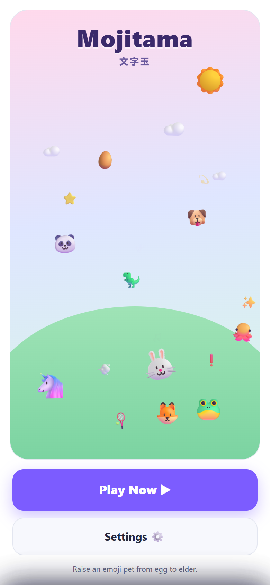
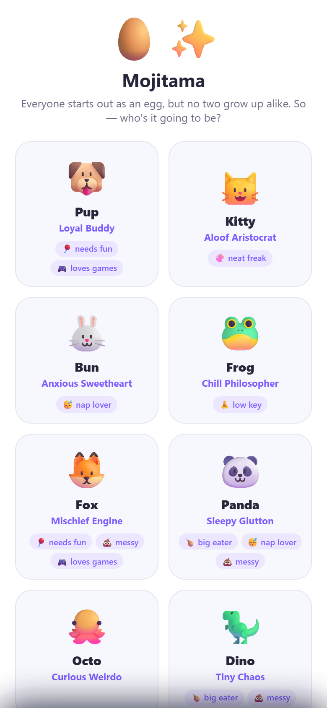
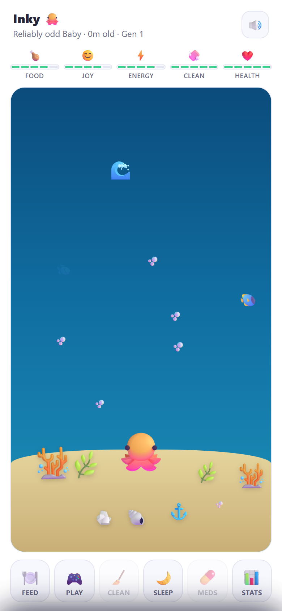
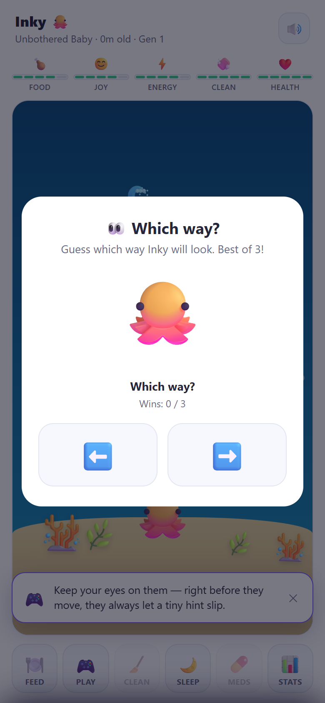
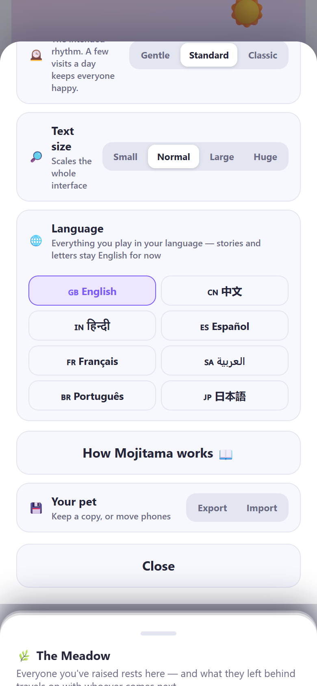

<div align="center">

# Mojitama 文字玉

**Raise an emoji pet from egg to elder.**

*Moji* (文字, character) + *tama* (玉, egg) — the same wordplay that gave the
original virtual pets their name.

**[▶ Play in your browser](https://r0073d-l053r.github.io/Mojitama/)** · **[⬇ Get the Android APK](../../releases/latest)**

<br>



<details>
<summary><b>📸 More screenshots</b></summary>
<br>

 

 

</details>

</div>

---

Mojitama is a virtual pet that lives on real time. Close the app and your pet keeps
living — getting hungry, bored, sleepy, and into messes without you. Come back,
take care of them, and watch who they turn into.

- **Ten species, ten personalities.** The panda is a bottomless stomach, the cat
  can entertain itself but won't tolerate dirt, the frog barely needs anything at
  all. Each lives in its own animated home — coral reef, bamboo grove, backyard,
  ice floe, cloud kingdom.
- **How you care shapes who they become.** At every growth stage your care is
  quietly graded, and your pet grows up Radiant, Contented, or Scrappy — it changes
  how they look and how life treats them.
- **Lives end, stories don't.** A pet that passes leaves an heirloom for the next
  egg, a place in the Meadow, and a last letter written just for you. Traits carry
  down bloodlines; two can even fuse into a family crest.
- **Weather, day and night, moon phases** — all synced to your real clock, and every
  species feels differently about a rainy day.
- **Eight languages** — English, 中文, हिन्दी, Español, Français, العربية, Português,
  日本語 — switchable in Settings, right-to-left included.
- **Three paces.** Classic is the demanding original; Gentle suits one check-in a
  day. Going on a trip? Send your pet on a sleepover and everything pauses safely.
- **Yours, entirely.** No account, no ads, no tracking, no server. Your pet lives in
  your browser or on your phone, and you can export a save file any time.

## 📱 Android (open beta)

The Android app is an **open beta and isn't on the Play Store**, so it has to be
sideloaded — Android will warn you about that, which is expected for any app
installed outside the store:

1. On your phone, download **`mojitama.apk`** from the
   [latest release](../../releases/latest).
2. Open the downloaded file. Android will ask you to allow installs from your
   browser (**Settings → Install unknown apps**) the first time.
3. If Play Protect asks, choose **Install anyway** — the app is self-contained and
   makes no network requests at all.
4. Done. Later releases install right over the top, saves intact.

The APK bundles the whole game — it works forever with airplane mode on. It also
adds a home-screen widget and optional care reminders.

## 🌐 Web / iPhone

**[Play it here](https://r0073d-l053r.github.io/Mojitama/)** — nothing to install.

To keep it like an app (recommended, it protects your save):

- **Android Chrome:** you'll get an install prompt, or use the **Install app**
  button in Settings.
- **iPhone Safari:** Share → **Add to Home Screen**. The game will walk you through
  it too.

## 🛠 Running it yourself

The entire game is **one HTML file with no dependencies**. Download
[`mojitama.html`](mojitama.html) and double-click it. That's it.

To host the installable version, serve the `pwa/` folder over http(s):

```bash
python -m http.server 8123 --directory pwa
```

### Building

`mojitama.html` is the single source of truth. Everything else is generated:

```bash
bash build-web.sh        # regenerates pwa/, docs/ (the hosted site) and mojitama-pwa.zip
bash apk-src/build-apk.sh  # builds the APK (calls build-web.sh first)
```

The APK build needs a JDK and the Android SDK (build-tools 35, platform 35) and
drives `aapt2 → javac → d8 → zipalign → apksigner` directly — no Gradle. Without a
`apk-src/signing.properties` (keystore=…, alias=…, password=… — deliberately not in
the repo), it signs with a throwaway debug key it generates on the spot.

### Tests

```bash
node tests/sim-test.js
```

87 assertions that run the real game code through days of simulated care, neglect,
sickness, offline catch-up, and generational hand-offs.

## 💾 Your save

Saves live on your device only — dual-slot, checksummed, mirrored to IndexedDB, and
exportable from **Settings → Your pet → Export** (that's also how you move phones).
The web version and the APK keep separate saves.

## 🐛 Beta feedback

This is an open beta — if your pet does something strange (or something delightful),
[open an issue](../../issues). Screenshots welcome.
